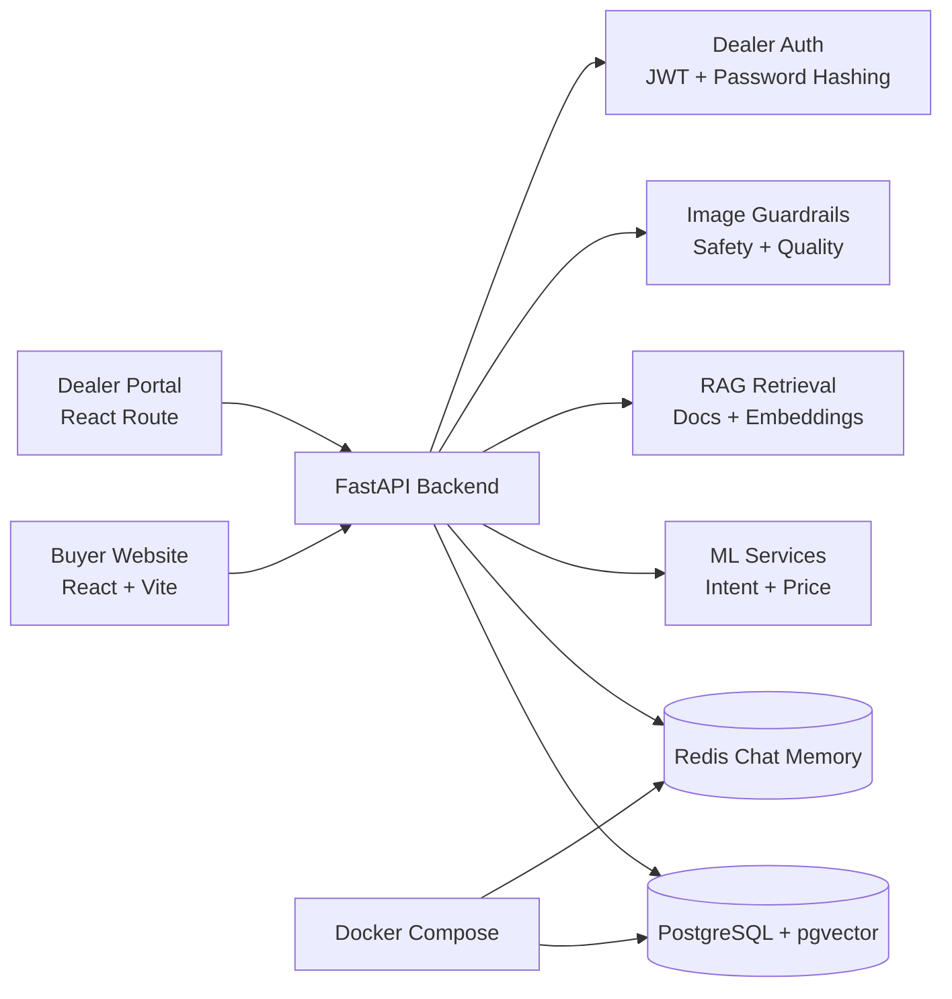

# AutoAdvisor AI

**AI-powered car discovery, fair-price estimation, and dealer lead management for Lebanon/MENA.**

AutoAdvisor AI is a working MVP that helps buyers discover suitable new and used cars, compare options, estimate used-car fair price, analyze uploaded car images, and save buyer interest as dealer inquiry drafts. It also includes a lightweight isolated dealer portal where demo dealership accounts can log in and view only the leads connected to their own inventory.

The project combines a polished React/Vite product experience with a FastAPI backend, PostgreSQL inventory, Redis chat memory, ML services, RAG knowledge retrieval, image guardrails, and dealer-specific lead visibility.

## Feature Highlights

- AI chatbot car recommendations with structured preference extraction.
- Inventory search across a curated demo inventory.
- Used-car fair-price estimation with ML and inventory calibration.
- Image-assisted car evaluation with safety, quality, and vehicle visibility checks.
- RAG-based car-buying advice grounded in local knowledge documents.
- Car comparison for selected inventory cars and confirmed uploaded profiles.
- Save Interest buyer flow that creates dealer inquiry drafts.
- Isolated dealer portal with dealer-specific lead visibility.
- Redis-backed chat memory.
- Optional OpenAI response polishing layer, disabled by default.

## AI Engineering Concepts

- **Intent classification:** TF-IDF and Logistic Regression classify chat messages into recommendation, comparison, price check, image, dealer contact, and advice intents.
- **Preference extraction:** Rule-based extraction pulls budgets, regions, listing type, body type, fuel, transmission, style preferences, and other car-shopping signals from natural language.
- **Recommendation scoring:** Inventory cars are scored against extracted preferences, availability, budget fit, and style signals such as family, city, luxury, performance, and exotic intent.
- **RAG with embeddings/vector search:** Curated Markdown knowledge is chunked, embedded, stored in PostgreSQL with pgvector, and used for grounded car-buying advice with lexical fallback.
- **ML price estimator:** A Random Forest regression model estimates used-car prices and is calibrated against similar cars in the AutoAdvisor inventory when possible.
- **Image safety and quality checks:** Upload guardrails validate file type, MIME, size, image readability, resolution, safety, blur, brightness, and vehicle visibility before analysis.
- **Similar-car matching:** Confirmed image-derived vehicle details can be used to find similar cars from inventory.
- **Optional LLM response layer:** OpenAI can rewrite backend-generated draft answers into more natural chatbot replies without inventing listings or prices.

## Architecture Overview



## User Workflow

```text
Buyer opens website
-> asks chatbot or searches inventory
-> compares cars, checks price, or uploads an image
-> saves interest in a car
-> dealer logs in
-> dealer sees only leads for that dealership
```

## Dealer Portal And Multi-Tenancy

Dealers log in with demo accounts. The frontend never decides which dealership's leads an authenticated dealer can view. Instead, the backend loads the authenticated dealer user from the JWT token, derives `dealership_id` server-side, and returns only matching leads from `/dealer/me/leads`.

This is lightweight dealership isolation for an MVP/demo. It is not a full enterprise SaaS multi-tenant system. Production would require stronger account management, audited access control, tenant administration, monitoring, and deployment hardening.

## Demo Dealer Accounts

These credentials are intentionally public for local demo purposes only. They work only with seeded demo data and must be changed or disabled before production deployment.

| Dealership Demo | Email | Password |
| --- | --- | --- |
| Beirut Auto Hub | `beirut@autoadvisor.demo` | `demo123` |
| Cedar Motors | `jounieh@autoadvisor.demo` | `demo123` |
| North Coast Motors | `tripoli@autoadvisor.demo` | `demo123` |

## Tech Stack

Python, FastAPI, React, Vite, PostgreSQL, pgvector, Redis, Docker Compose, SQLAlchemy, Pydantic, scikit-learn, Random Forest, TF-IDF, Logistic Regression, SentenceTransformers, RAG, JWT, PBKDF2 password hashing, Streamlit backup UI, GitHub.

## Quick Start

Use Windows CMD.

Terminal 1:

```cmd
cd C:\Users\user\Desktop\AutoAdvisor-AI
docker compose up -d
```

Terminal 2:

```cmd
cd C:\Users\user\Desktop\AutoAdvisor-AI
.venv\Scripts\activate
set PYTHONPATH=%CD%
uvicorn backend.app.main:app
```

Terminal 3:

```cmd
cd C:\Users\user\Desktop\AutoAdvisor-AI\web-frontend
npm run dev
```

Main app:

```text
http://localhost:5173
```

Dealer portal:

```text
http://localhost:5173/dealer-dashboard
```

Backend docs:

```text
http://127.0.0.1:8000/docs
```

## Demo Reset

Before a clean demo, clear saved buyer interests only:

```cmd
cd C:\Users\user\Desktop\AutoAdvisor-AI
.venv\Scripts\activate
set PYTHONPATH=%CD%
python scripts\reset_demo_leads.py
```

This does not delete cars, dealerships, RAG documents, image data, or dealer users.

## Testing

```cmd
cd C:\Users\user\Desktop\AutoAdvisor-AI
.venv\Scripts\activate
set PYTHONPATH=%CD%
python -m pytest tests
```

```cmd
cd C:\Users\user\Desktop\AutoAdvisor-AI\web-frontend
npm run build
```

## Project Structure

```text
backend/        FastAPI app, API routes, models, services, auth, and database setup
web-frontend/   React/Vite final product UI and dealer portal route
frontend/       Streamlit legacy/backup demo dashboard
data/           Seed inventory, RAG docs, and training data
models/         Trained ML artifacts
scripts/        Seed, reset, ingestion, embedding, and training helpers
specs/          Spec-driven development roadmap and task history
docs/           Architecture, runbook, workflow, evaluation, and security docs
tests/          Backend test suite
```

## Limitations And Future Work

- The inventory is curated demo data, not live marketplace scraping.
- Vehicle images are representative demo visuals, not verified listing photos.
- Dealer inquiry and Save Interest flows create drafts only; no email, WhatsApp message, or dealer contact is sent automatically.
- Dealer authentication and isolation are demo-grade, not full production SaaS tenancy.
- Production would require verified dealer feeds, stronger authentication, hosting, monitoring, observability, backups, privacy review, and operational security hardening.

## Documentation

- [Runbook](docs/RUNBOOK.md)
- [Architecture](docs/ARCHITECTURE.md)
- [Workflow](docs/WORKFLOW.md)
- [Security Notes](docs/SECURITY.md)
- [Evaluation](docs/EVALUATION.md)
- [Demo Script](docs/demo-script.md)
