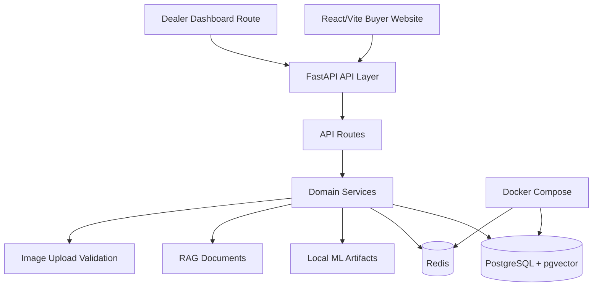
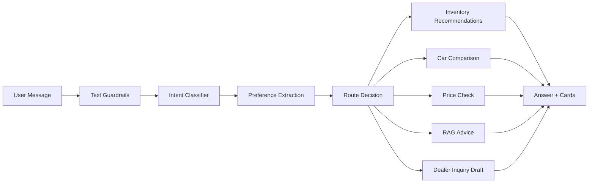
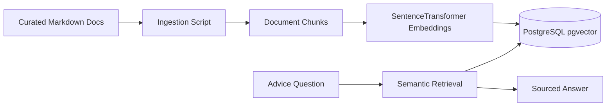
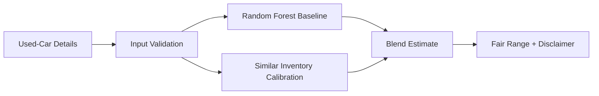
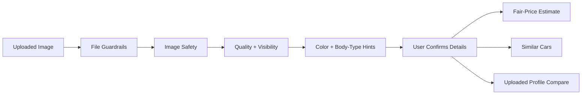

# AutoAdvisor AI Architecture

AutoAdvisor AI is a modular MVP with a React/Vite frontend, FastAPI backend, PostgreSQL inventory and vector storage, Redis chat memory, ML services, RAG retrieval, image guardrails, and a lightweight isolated dealer portal.

## High-Level Architecture



## Request Lifecycle

1. The React frontend sends a request to the FastAPI backend.
2. FastAPI validates the request with Pydantic schemas.
3. Route handlers delegate to focused services.
4. Services query PostgreSQL, Redis, local ML artifacts, or RAG chunks.
5. The backend returns structured responses.
6. The frontend renders user-friendly cards, chat replies, comparisons, or dashboard views.

## Chatbot Flow



Guardrail-blocked messages receive safe responses before intent classification. Normal car-shopping messages continue through routing, extraction, and the relevant service.

## RAG Flow



RAG answers use retrieved local sources when possible. If knowledge is insufficient, the system should avoid unsupported claims.

## Price Estimator Flow



The estimator is for used cars only. It does not guarantee real market value, financing outcomes, insurance outcomes, or dealer acceptance.

## Image-Assisted Evaluation Flow



AutoAdvisor does not estimate price from image alone and does not guarantee exact make/model recognition from image. The image flow provides safety, quality, and context; structured actions use user-confirmed vehicle details.

## Dealer Portal Isolation Flow

```mermaid
flowchart LR
    Login[Dealer Login] --> Token[JWT Token]
    Token --> Me[Backend Loads Dealer User]
    Me --> DealerID[dealership_id Derived Server-Side]
    DealerID --> Leads[/dealer/me/leads]
    Leads --> Filtered[Only That Dealership's Leads]
```

The authenticated dealer endpoint does not trust a frontend-selected dealership ID. It derives dealership ownership from the token and database record.

## Docker Compose Services

- PostgreSQL with pgvector stores inventory, dealerships, dealer users, leads, RAG documents, and embeddings.
- Redis stores short-term chat memory.
- The backend and frontend run locally outside Docker in the current development setup.
